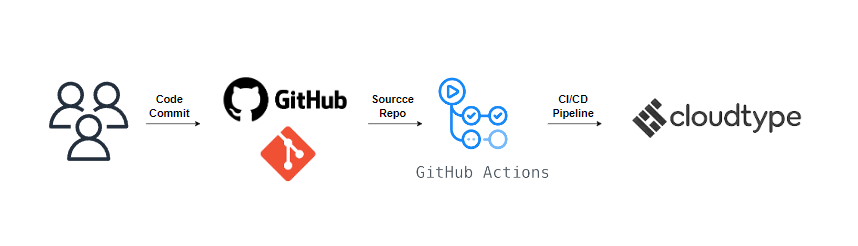

# mumo

## 목차
- [프로젝트 소개](#project-introduction)
- [주요 기능](#main-function)
- [개발 환경](#development-environment)
- [CI/CD 파이프라인](#cicd-pipeline)

 

## 프로젝트 소개
메가박스, CGV, 롯데시네마 시네마 사이트에서 크롤링한 무대인사 정보를 지도, 달력 등으로 다양하게 모아보는 토이 프로젝트입니다.

 

## 주요 기능
- 시네마의 무대인사 정보 사이트 바로가기
  
</img>
 
 
- 무대인사 정보 지도로 보기
  
  
</img>
 
 
- 무대인사 정보 달력으로 보기
  
</img>
  

 

## 개발 환경

| Service | Dev Language | DevTools |
|----------|----------|----------|
| BE API | Golang | gin web framework, GROM, chromedp, Swagger, JWT, OAuth, PostgreSql |
| Front | javascript | React, Redux |

## CI/CD 파이프라인
</img>
